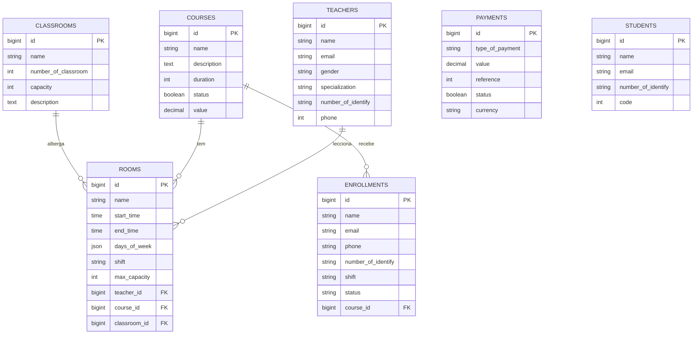
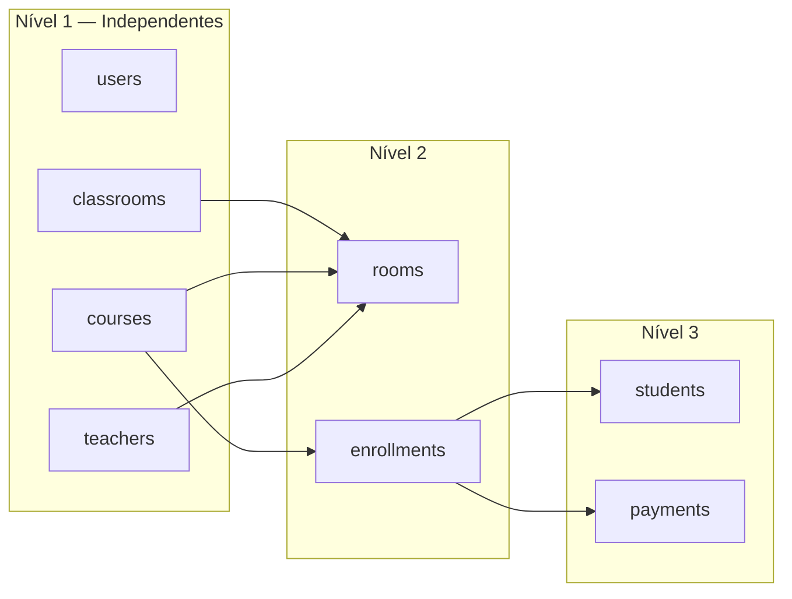
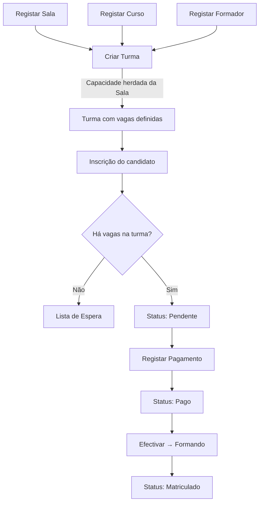
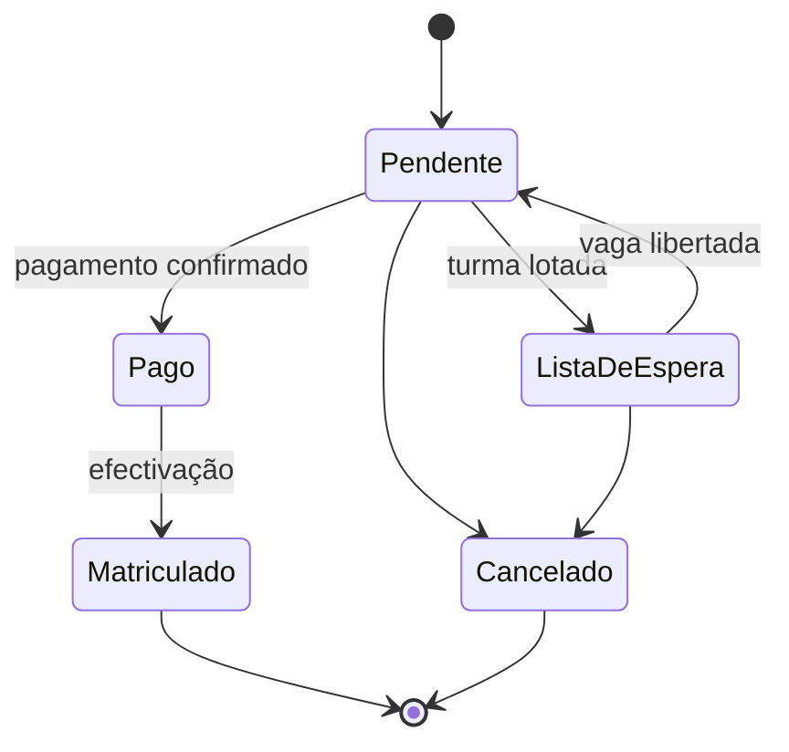
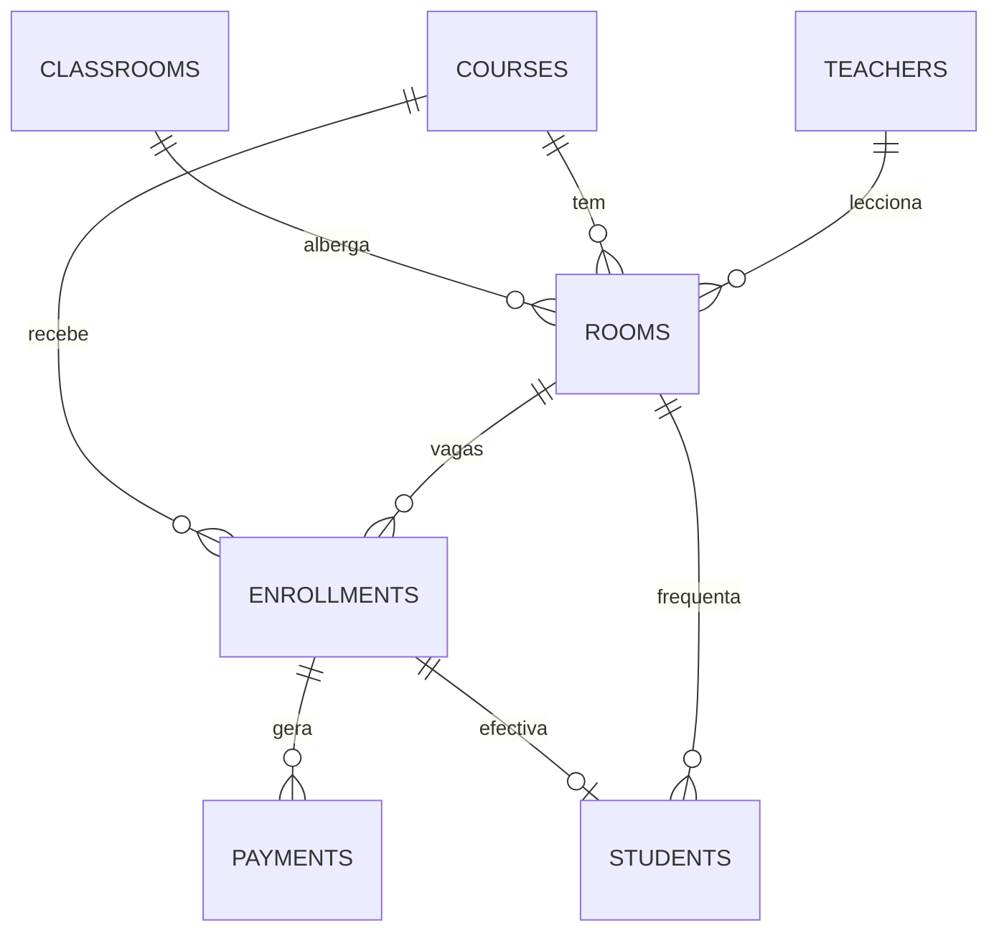

# 📘 Centro de Formação — Estrutura do Projecto

Sistema de gestão de um centro de formação profissional, desenvolvido em **Laravel** (PHP) com **MySQL** e vistas **Blade** (tema administrativo DexignLab).

---

## Índice

1. [Tecnologias](#1-tecnologias)
2. [Estrutura de Pastas](#2-estrutura-de-pastas)
3. [Módulos do Sistema](#3-módulos-do-sistema)
4. [Base de Dados](#4-base-de-dados)
5. [Diagrama de Entidades (ERD)](#5-diagrama-de-entidades-erd)
6. [Models e Relacionamentos](#6-models-e-relacionamentos)
7. [Rotas](#7-rotas)
8. [Controladores](#8-controladores)
9. [Vistas (Views)](#9-vistas-views)
10. [Ordem de Criação das Entidades](#10-ordem-de-criação-das-entidades)
11. [Fluxo Operacional](#11-fluxo-operacional)
12. [Regras de Negócio](#12-regras-de-negócio)
13. [Pendências e Melhorias Recomendadas](#13-pendências-e-melhorias-recomendadas)
14. [Como Executar](#14-como-executar)

---

## 1. Tecnologias

| Camada | Tecnologia |
| :--- | :--- |
| Backend | PHP + Laravel |
| Base de dados | MySQL (`centroformacao`) |
| Frontend | Blade, Bootstrap, jQuery, Select2 |
| Ícones | Material Symbols, Font Awesome |
| Assets | Laravel Mix (`webpack.mix.js`) |

---

## 2. Estrutura de Pastas

```text
centroFormacao/
├── app/
│   ├── Http/
│   │   └── Controllers/
│   │       ├── Controller.php
│   │       ├── classroomController.php     # Salas
│   │       ├── courseController.php        # Cursos
│   │       ├── enrollmentController.php    # Inscrições
│   │       ├── paymentController.php       # Pagamentos
│   │       ├── roomController.php          # Turmas
│   │       ├── studentController.php       # Formandos
│   │       └── teacherController.php       # Formadores
│   └── Models/
│       ├── Classroom.php
│       ├── Course.php
│       ├── Enrollment.php
│       ├── Payment.php
│       ├── Room.php
│       ├── Student.php
│       ├── Teacher.php
│       └── User.php
├── database/
│   └── migrations/
│       ├── 2014_10_12_000000_create_users_table.php
│       ├── 2019_08_19_000000_create_failed_jobs_table.php
│       ├── 2026_09_23_103900_create_students_table.php
│       ├── 2026_09_23_104110_create_teachers_table.php
│       ├── 2026_09_23_104252_create_courses_table.php
│       ├── 2026_09_23_104758_create_payments_table.php
│       ├── 2026_09_23_105833_create_rooms_table.php
│       ├── 2026_09_23_110029_create_enrollments_table.php
│       ├── 2026_09_30_141257_create_classrooms_table.php
│       └── 2026_10_01_000000_add_classroom_id_to_rooms_table.php
├── resources/
│   └── views/
│       ├── layout/
│       │   ├── app.blade.php
│       │   ├── main.blade.php        # Layout base das páginas
│       │   ├── header.blade.php
│       │   ├── menu.blade.php        # Menu lateral
│       │   └── footer.blade.php
│       ├── components/
│       │   ├── graphic.blade.php
│       │   └── graphic_class.blade.php
│       └── admin/
│           ├── dashboard/   (index, walletbar)
│           ├── classroom/   (list, create, edit, detail)
│           ├── course/      (list, create, edit, details)
│           ├── teacher/     (list, create, edit, details)
│           ├── room/        (list, create, edit, details)
│           ├── enrollment/  (list, create, edit, details)
│           ├── payment/     (list, create, edit, details)
│           └── student/     (list, edit, details)
├── routes/
│   └── web.php
├── public/
├── .env
└── composer.json
```

---

## 3. Módulos do Sistema

| Módulo | Entidade (Model) | Tabela | Prefixo URL | Descrição |
| :--- | :--- | :--- | :--- | :--- |
| Dashboard | — | — | `/` | Página inicial com indicadores |
| Sala | `Classroom` | `classrooms` | `/sala` | Espaços físicos e respectiva capacidade |
| Curso | `Course` | `courses` | `/curso` | Oferta formativa |
| Formador | `Teacher` | `teachers` | `/formador` | Corpo docente |
| Turma | `Room` | `rooms` | `/turma` | Junta curso + formador + sala + horário |
| Inscrição | `Enrollment` | `enrollments` | `/inscricao` | Candidatura a um curso |
| Pagamento | `Payment` | `payments` | `/pagamento` | Pagamentos das inscrições |
| Formando | `Student` | `students` | `/formando` | Aluno efectivado |

> [!NOTE]
> Nos nomes técnicos, **`Room` = Turma** e **`Classroom` = Sala física**.

---

## 4. Base de Dados

Todas as tabelas de negócio possuem `id`, `created_at`, `updated_at` e `deleted_at` (**Soft Delete**).

### 4.1 `classrooms` — Salas

| Coluna | Tipo | Obs. |
| :--- | :--- | :--- |
| `id` | bigint | PK |
| `number_of_classroom` | integer | Número da sala (único) |
| `capacity` | integer | **Define a capacidade das turmas** |
| `description` | text | nullable |

### 4.2 `courses` — Cursos

| Coluna | Tipo | Obs. |
| :--- | :--- | :--- |
| `id` | bigint | PK |
| `name` | string | |
| `description` | text | |
| `duration` | integer | Horas |
| `status` | boolean | Activo / Inactivo |
| `value` | decimal(15,2) | Preço (Kz) |

### 4.3 `teachers` — Formadores

| Coluna | Tipo | Obs. |
| :--- | :--- | :--- |
| `id` | bigint | PK |
| `name` | string | |
| `email` | string | único |
| `gender` | string | |
| `specialization` | string | |
| `number_of_identify` | string | BI — único |
| `phone` | integer | |
| `image` | string | nullable |

### 4.4 `rooms` — Turmas

| Coluna | Tipo | Obs. |
| :--- | :--- | :--- |
| `id` | bigint | PK |
| `name` | string | Nome da turma |
| `start_time` | time | Hora de início |
| `end_time` | time | Hora de término |
| `days_of_week` | json | Ex.: `["Segunda-feira","Quarta-feira"]` |
| `shift` | string | Manhã / Tarde / Pós-Laboral |
| `max_capacity` | integer | **Herdado de `classrooms.capacity`** |
| `teacher_id` | FK | → `teachers.id` |
| `course_id` | FK | → `courses.id` |
| `classroom_id` | FK | → `classrooms.id` (nullable, `nullOnDelete`) |

### 4.5 `enrollments` — Inscrições

| Coluna | Tipo | Obs. |
| :--- | :--- | :--- |
| `id` | bigint | PK |
| `name` | string | |
| `email` | string | |
| `phone` | string | |
| `number_of_identify` | string | BI |
| `image` | string | nullable |
| `shift` | string | Turno pretendido |
| `status` | string | `Pendente` (padrão), `Pago`, `Matriculado`, `Lista de Espera`, `Cancelado` |
| `date` | datetime | nullable |
| `course_id` | FK | → `courses.id` |

### 4.6 `payments` — Pagamentos

| Coluna | Tipo | Obs. |
| :--- | :--- | :--- |
| `id` | bigint | PK |
| `type_of_payment` | string | Ex.: Transferência, Multicaixa |
| `value` | decimal(15,2) | |
| `reference` | integer | |
| `status` | boolean | Pago / Não pago |
| `date` | datetime | |
| `currency` | string | Ex.: AOA |

### 4.7 `students` — Formandos

| Coluna | Tipo | Obs. |
| :--- | :--- | :--- |
| `id` | bigint | PK |
| `name` | string | |
| `email` | string | |
| `number_of_identify` | string | BI |
| `phone` | integer | |
| `code` | integer | Nº de formando |
| `image` | string | |

### 4.8 Tabelas do sistema

- `users` — utilizadores administradores (autenticação).
- `failed_jobs` — falhas de filas (Laravel).

---

## 5. Diagrama de Entidades (ERD)

Estado **actual** da base de dados:



> [!WARNING]
> `PAYMENTS` e `STUDENTS` ainda **não têm chave estrangeira** para `ENROLLMENTS`, apesar de o model `Enrollment` já declarar essas relações. Ver [secção 13](#13-pendências-e-melhorias-recomendadas).

---

## 6. Models e Relacionamentos

| Model | Relação | Tipo | Chave |
| :--- | :--- | :--- | :--- |
| `Classroom` | `rooms()` | hasMany → `Room` | `classroom_id` |
| `Room` | `teacher()` | belongsTo → `Teacher` | `teacher_id` |
| `Room` | `course()` | belongsTo → `Course` | `course_id` |
| `Room` | `classroom()` | belongsTo → `Classroom` | `classroom_id` |
| `Room` | `student()` | belongsTo → `Student` | `student_id` ⚠️ coluna inexistente |
| `Enrollment` | `course()` | belongsTo → `Course` | `course_id` |
| `Enrollment` | `payments()` | hasMany → `Payment` | `enrollment_id` ⚠️ coluna inexistente |
| `Enrollment` | `student()` | hasOne → `Student` | `enrollment_id` ⚠️ coluna inexistente |

**Casts:**
- `Room::$casts` → `days_of_week => array`
- `Course::$casts` → `status => boolean`
- `Payment::$cast` ⚠️ (deveria ser `$casts`)

---

## 7. Rotas

Ficheiro: `routes/web.php`. Todos os módulos seguem o mesmo padrão CRUD:

| Método | URI | Acção | Nome |
| :--- | :--- | :--- | :--- |
| GET | `/{modulo}/listar` | `index` | `{entidade}.index` |
| GET | `/{modulo}/adicionar` | `create` | `{entidade}.create` |
| POST | `/{modulo}` | `store` | `{entidade}.store` |
| GET | `/{modulo}/{id}` | `show` | `{entidade}.show` |
| GET | `/{modulo}/edit/{id}` | `edit` | `{entidade}.edit` |
| PUT | `/{modulo}/update/{id}` | `update` | `{entidade}.update` |
| DELETE | `/{modulo}/{id}` | `destroy` | `{entidade}.destroy` |

| Módulo (URL) | Nome da rota | Controlador |
| :--- | :--- | :--- |
| `curso` | `course.*` | `courseController` |
| `formador` | `teacher.*` | `teacherController` |
| `sala` | `classroom.*` | `classroomController` |
| `turma` | `room.*` | `roomController` |
| `formando` | `student.*` | `studentController` |
| `inscricao` | `enrollment.*` | `enrollmentController` |
| `pagamento` | `payment.*` | `paymentController` |

---

## 8. Controladores

| Controlador | Estado | Notas |
| :--- | :--- | :--- |
| `courseController` | ✅ CRUD | |
| `teacherController` | ✅ CRUD | |
| `classroomController` | ✅ CRUD | `index` usa `withCount('rooms')`; `show` lista turmas da sala |
| `roomController` | ✅ CRUD | Carrega salas; força `max_capacity = classroom.capacity` no `store`/`update` |
| `enrollmentController` | ✅ CRUD | |
| `studentController` | 🟡 Parcial | |
| `paymentController` | 🟡 Parcial | |

---

## 9. Vistas (Views)

Todas as páginas estendem `layout.main` e usam `@section('content')`.

```text
admin/{modulo}/
├── list/index.blade.php      # Tabela + dropdown (Ver, Editar, Eliminar)
├── create/index.blade.php    # Formulário de registo
├── edit/index.blade.php      # Formulário de edição
└── details/index.blade.php   # Detalhes (na sala: detail/)
```

**Menu lateral** (`layout/menu.blade.php`), por ordem:
Dashboard → Curso → Formador → **Sala** → Turma → Formando → Pagamento → Inscrição.

---

## 10. Ordem de Criação das Entidades

### 10.1 Técnica (migrações / chaves estrangeiras)



### 10.2 Operacional (no painel)

| Ordem | Entidade | Depende de |
| :---: | :--- | :--- |
| 1 | Sala | — |
| 2 | Curso | — |
| 3 | Formador | — |
| 4 | Turma | Sala, Curso, Formador |
| 5 | Inscrição | Curso (e idealmente Turma) |
| 6 | Pagamento | Inscrição |
| 7 | Formando | Inscrição paga |

---

## 11. Fluxo Operacional



**Estados da inscrição:**



---

## 12. Regras de Negócio

1. **Capacidade da turma = capacidade da sala.**
   - No formulário da turma, `max_capacity` é `readonly` (fundo cinzento) e preenchido por JavaScript ao escolher a sala.
   - No servidor, `roomController@store` e `@update` sobrescrevem `max_capacity` com `classroom.capacity`.
2. Uma **sala** pode ter várias **turmas** (em horários/turnos diferentes).
3. Ao eliminar uma sala, `rooms.classroom_id` passa a `NULL` (`nullOnDelete`).
4. Todas as eliminações são **lógicas** (Soft Delete).
5. Turnos permitidos: `Manhã`, `Tarde`, `Pós-Laboral`.

---

## 13. Pendências e Melhorias Recomendadas

| # | Problema | Solução proposta |
| :---: | :--- | :--- |
| 1 | `payments` sem `enrollment_id` | Migração: `foreignId('enrollment_id')->constrained()` |
| 2 | `students` sem `enrollment_id` | Migração: `foreignId('enrollment_id')->nullable()->constrained()` |
| 3 | Formando não está ligado a uma turma | Adicionar `room_id` em `enrollments` e/ou `students` |
| 4 | `Room::student()` usa coluna inexistente | Substituir por `hasMany(Student::class)` após o item 3 |
| 5 | `Payment::$cast` | Renomear para `$casts` |
| 6 | `phone` como `integer` em `teachers`/`students` | Mudar para `string` (zeros à esquerda, `+244`) |
| 7 | `classrooms.capacity` obrigatório na BD mas `nullable` na validação | Tornar `required` no `classroomController` |
| 8 | Sem validação de conflito de horário | Impedir duas turmas na mesma sala, dia e hora |
| 9 | Sem controlo de vagas | Bloquear inscrição quando a turma atingir `max_capacity` |
| 10 | Rotas sem autenticação | Envolver rotas em `middleware('auth')` |

**ERD alvo** (após as melhorias):



---

## 14. Como Executar

```bash
# 1. Dependências
composer install
npm install && npm run dev

# 2. Ambiente
cp .env.example .env
php artisan key:generate
# Configurar DB_DATABASE, DB_USERNAME e DB_PASSWORD no .env

# 3. Base de dados (o MySQL tem de estar a correr)
php artisan migrate

# 4. Servidor
php artisan serve   # http://127.0.0.1:8000
```
