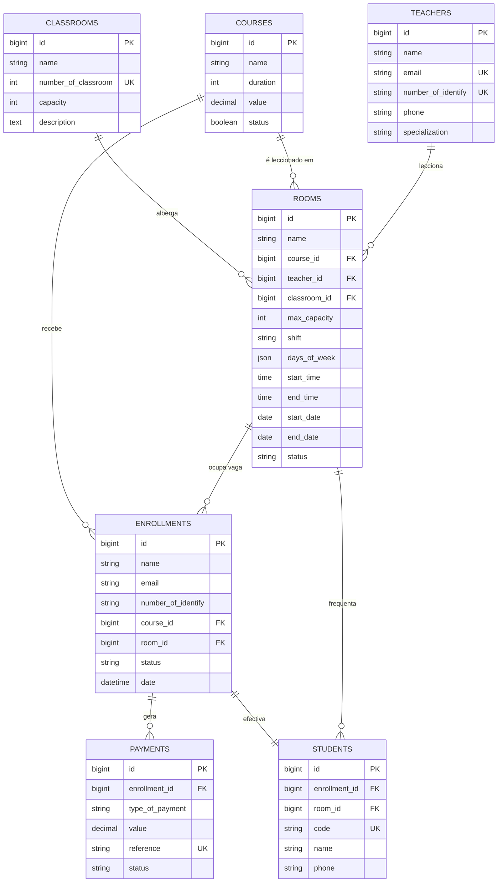
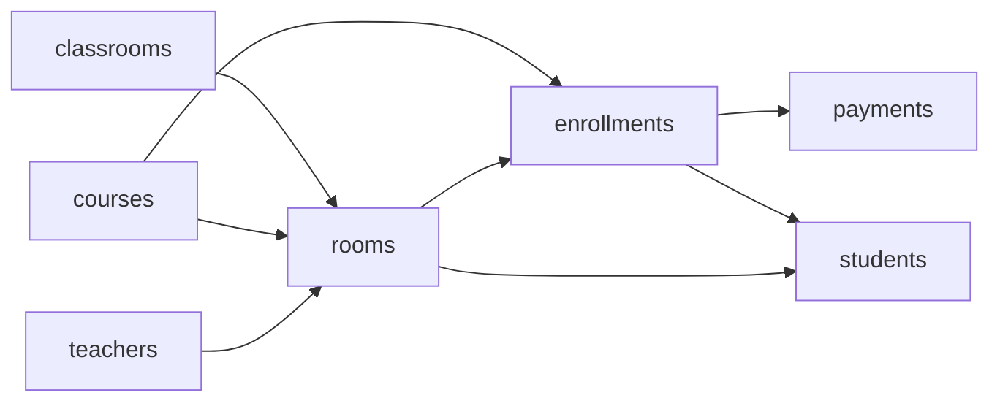
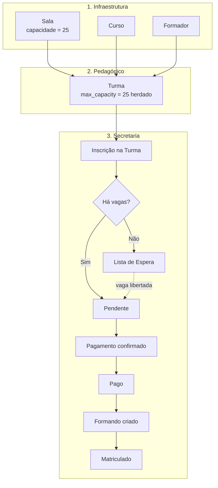

# 🎯 Centro de Formação — Estrutura Ideal do Projecto

Este documento mostra **como o projecto deveria ficar** depois de incluir o **Módulo de Sala**, a regra **"capacidade da turma = capacidade da sala"** e as correcções identificadas em [`ESTRUTURA_DO_PROJETO.md`](./ESTRUTURA_DO_PROJETO.md).

> [!NOTE]
> Convenção de nomes: **`Classroom` = Sala física** · **`Room` = Turma**.

---

## Índice

1. [Princípios da Estrutura](#1-princípios-da-estrutura)
2. [Estrutura de Pastas Ideal](#2-estrutura-de-pastas-ideal)
3. [Base de Dados Ideal](#3-base-de-dados-ideal)
4. [Diagrama de Entidades (ERD)](#4-diagrama-de-entidades-erd)
5. [Migrações (ordem correcta)](#5-migrações-ordem-correcta)
6. [Models e Relacionamentos](#6-models-e-relacionamentos)
7. [Validações (Form Requests)](#7-validações-form-requests)
8. [Controladores](#8-controladores)
9. [Rotas](#9-rotas)
10. [Vistas](#10-vistas)
11. [Regras de Negócio](#11-regras-de-negócio)
12. [Fluxo Completo](#12-fluxo-completo)
13. [Comparação: Actual vs Ideal](#13-comparação-actual-vs-ideal)
14. [Plano de Migração](#14-plano-de-migração)

---

## 1. Princípios da Estrutura

1. **Infraestrutura primeiro**: Sala, Curso e Formador são entidades independentes.
2. **A Turma é o centro**: junta Curso + Formador + Sala + Horário.
3. **A Sala manda na capacidade**: a turma nunca define a capacidade manualmente.
4. **Inscrição é feita numa Turma** (não apenas num curso), para controlar vagas.
5. **Pagamento pertence a uma Inscrição.**
6. **Formando nasce de uma Inscrição paga** e fica ligado à turma.
7. Validações fora dos controladores (**Form Requests**) e rotas protegidas por **autenticação**.

---

## 2. Estrutura de Pastas Ideal

```text
centroFormacao/
├── app/
│   ├── Http/
│   │   ├── Controllers/
│   │   │   ├── Controller.php
│   │   │   ├── DashboardController.php        # [NOVO] indicadores do painel
│   │   │   ├── classroomController.php        # Salas
│   │   │   ├── courseController.php           # Cursos
│   │   │   ├── teacherController.php          # Formadores
│   │   │   ├── roomController.php             # Turmas
│   │   │   ├── enrollmentController.php       # Inscrições
│   │   │   ├── paymentController.php          # Pagamentos
│   │   │   └── studentController.php          # Formandos
│   │   └── Requests/                          # [NOVO] validações
│   │       ├── ClassroomRequest.php
│   │       ├── CourseRequest.php
│   │       ├── TeacherRequest.php
│   │       ├── RoomRequest.php
│   │       ├── EnrollmentRequest.php
│   │       ├── PaymentRequest.php
│   │       └── StudentRequest.php
│   └── Models/
│       ├── Classroom.php
│       ├── Course.php
│       ├── Teacher.php
│       ├── Room.php
│       ├── Enrollment.php
│       ├── Payment.php
│       ├── Student.php
│       └── User.php
├── database/
│   ├── migrations/                            # ver secção 5
│   └── seeders/
│       ├── DatabaseSeeder.php
│       ├── UserSeeder.php                     # [NOVO] admin inicial
│       ├── ClassroomSeeder.php                # [NOVO] dados de teste
│       ├── CourseSeeder.php                   # [NOVO]
│       └── TeacherSeeder.php                  # [NOVO]
├── resources/views/
│   ├── layout/ (main, header, menu, footer)
│   ├── components/
│   │   ├── alerts.blade.php                   # [NOVO] mensagens de sucesso/erro
│   │   └── delete-button.blade.php            # [NOVO] botão eliminar reutilizável
│   └── admin/
│       ├── dashboard/index.blade.php
│       ├── classroom/{list,create,edit,details}/index.blade.php
│       ├── course/{list,create,edit,details}/index.blade.php
│       ├── teacher/{list,create,edit,details}/index.blade.php
│       ├── room/{list,create,edit,details}/index.blade.php
│       ├── enrollment/{list,create,edit,details}/index.blade.php
│       ├── payment/{list,create,edit,details}/index.blade.php
│       └── student/{list,edit,details}/index.blade.php
└── routes/web.php
```

> [!TIP]
> Uniformizar a pasta de detalhes da sala: `classroom/detail` → `classroom/details` (como nos outros módulos).

---

## 3. Base de Dados Ideal

Todas as tabelas de negócio têm `id`, `created_at`, `updated_at` e `deleted_at` (Soft Delete).

### 3.1 `classrooms` — Salas

| Coluna | Tipo | Regras |
| :--- | :--- | :--- |
| `name` | string | obrigatório |
| `number_of_classroom` | integer | obrigatório, **único** |
| `capacity` | unsigned integer | obrigatório, ≥ 1 |
| `description` | text | nullable |

### 3.2 `courses` — Cursos

| Coluna | Tipo | Regras |
| :--- | :--- | :--- |
| `name` | string | obrigatório |
| `description` | text | nullable |
| `duration` | unsigned integer | horas |
| `value` | decimal(15,2) | preço |
| `status` | boolean | default `true` |

### 3.3 `teachers` — Formadores

| Coluna | Tipo | Regras |
| :--- | :--- | :--- |
| `name` | string | |
| `email` | string | único |
| `gender` | string | `M` / `F` |
| `specialization` | string | |
| `number_of_identify` | string | único (BI) |
| `phone` | **string(20)** | ✏️ era `integer` |
| `image` | string | nullable |

### 3.4 `rooms` — Turmas

| Coluna | Tipo | Regras |
| :--- | :--- | :--- |
| `name` | string | |
| `course_id` | FK → `courses` | obrigatório |
| `teacher_id` | FK → `teachers` | obrigatório |
| `classroom_id` | FK → `classrooms` | ✏️ **obrigatório** (capacidade depende dela) |
| `max_capacity` | unsigned integer | **copiado de `classrooms.capacity`** |
| `shift` | string | Manhã / Tarde / Pós-Laboral |
| `days_of_week` | json | |
| `start_time` | time | |
| `end_time` | time | depois de `start_time` |
| `start_date` | date | ➕ nullable — início da formação |
| `end_date` | date | ➕ nullable — fim da formação |
| `status` | string | ➕ `Aberta`, `Em curso`, `Concluída`, `Cancelada` |

### 3.5 `enrollments` — Inscrições

| Coluna | Tipo | Regras |
| :--- | :--- | :--- |
| `name` | string | |
| `email` | string | |
| `phone` | string(20) | |
| `number_of_identify` | string | BI |
| `image` | string | nullable |
| `course_id` | FK → `courses` | |
| `room_id` | FK → `rooms` | ➕ **turma escolhida** (nullable se em lista de espera) |
| `shift` | string | turno pretendido |
| `status` | string | `Pendente`, `Pago`, `Matriculado`, `Lista de Espera`, `Cancelado` |
| `date` | datetime | data da inscrição |

### 3.6 `payments` — Pagamentos

| Coluna | Tipo | Regras |
| :--- | :--- | :--- |
| `enrollment_id` | FK → `enrollments` | ➕ **obrigatório** |
| `type_of_payment` | string | Transferência, Multicaixa, Numerário |
| `value` | decimal(15,2) | |
| `currency` | string(3) | default `AOA` |
| `reference` | **string** | ✏️ era `integer`; único |
| `status` | string | ✏️ `Pendente`, `Confirmado`, `Anulado` |
| `date` | datetime | |

### 3.7 `students` — Formandos

| Coluna | Tipo | Regras |
| :--- | :--- | :--- |
| `enrollment_id` | FK → `enrollments` | ➕ **único** (1 inscrição → 1 formando) |
| `room_id` | FK → `rooms` | ➕ turma que frequenta |
| `code` | **string** | ✏️ único — ex.: `CF-2026-0001` |
| `name` | string | |
| `email` | string | |
| `number_of_identify` | string | |
| `phone` | **string(20)** | ✏️ era `integer` |
| `image` | string | nullable |

**Legenda:** ➕ coluna nova · ✏️ coluna alterada

---

## 4. Diagrama de Entidades (ERD)



---

## 5. Migrações (ordem correcta)

A ordem dos ficheiros tem de respeitar as chaves estrangeiras:

```text
database/migrations/
├── 2014_10_12_000000_create_users_table.php
├── 2019_08_19_000000_create_failed_jobs_table.php
├── 2026_09_23_100000_create_classrooms_table.php     # Nível 1
├── 2026_09_23_100100_create_courses_table.php        # Nível 1
├── 2026_09_23_100200_create_teachers_table.php       # Nível 1
├── 2026_09_23_100300_create_rooms_table.php          # Nível 2 → classrooms, courses, teachers
├── 2026_09_23_100400_create_enrollments_table.php    # Nível 3 → courses, rooms
├── 2026_09_23_100500_create_payments_table.php       # Nível 4 → enrollments
└── 2026_09_23_100600_create_students_table.php       # Nível 4 → enrollments, rooms
```



### Exemplo — `rooms`

```php
Schema::create('rooms', function (Blueprint $table) {
    $table->id();
    $table->string('name');
    $table->foreignId('course_id')->constrained();
    $table->foreignId('teacher_id')->constrained();
    $table->foreignId('classroom_id')->constrained();
    $table->unsignedInteger('max_capacity');
    $table->string('shift');
    $table->json('days_of_week');
    $table->time('start_time');
    $table->time('end_time');
    $table->date('start_date')->nullable();
    $table->date('end_date')->nullable();
    $table->string('status')->default('Aberta');
    $table->softDeletes();
    $table->timestamps();
});
```

### Exemplo — `enrollments`

```php
Schema::create('enrollments', function (Blueprint $table) {
    $table->id();
    $table->string('name');
    $table->string('email');
    $table->string('phone', 20);
    $table->string('number_of_identify');
    $table->string('image')->nullable();
    $table->foreignId('course_id')->constrained();
    $table->foreignId('room_id')->nullable()->constrained()->nullOnDelete();
    $table->string('shift');
    $table->string('status')->default('Pendente');
    $table->dateTime('date')->nullable();
    $table->softDeletes();
    $table->timestamps();
});
```

### Exemplo — `payments`

```php
Schema::create('payments', function (Blueprint $table) {
    $table->id();
    $table->foreignId('enrollment_id')->constrained();
    $table->string('type_of_payment');
    $table->decimal('value', 15, 2);
    $table->string('currency', 3)->default('AOA');
    $table->string('reference')->unique();
    $table->string('status')->default('Pendente');
    $table->dateTime('date');
    $table->softDeletes();
    $table->timestamps();
});
```

### Exemplo — `students`

```php
Schema::create('students', function (Blueprint $table) {
    $table->id();
    $table->foreignId('enrollment_id')->unique()->constrained();
    $table->foreignId('room_id')->constrained();
    $table->string('code')->unique();
    $table->string('name');
    $table->string('email');
    $table->string('number_of_identify');
    $table->string('phone', 20);
    $table->string('image')->nullable();
    $table->softDeletes();
    $table->timestamps();
});
```

---

## 6. Models e Relacionamentos

| Model | Método | Relação |
| :--- | :--- | :--- |
| `Classroom` | `rooms()` | `hasMany(Room)` |
| `Course` | `rooms()` | `hasMany(Room)` |
| `Course` | `enrollments()` | `hasMany(Enrollment)` |
| `Teacher` | `rooms()` | `hasMany(Room)` |
| `Room` | `classroom()` | `belongsTo(Classroom)` |
| `Room` | `course()` | `belongsTo(Course)` |
| `Room` | `teacher()` | `belongsTo(Teacher)` |
| `Room` | `enrollments()` | `hasMany(Enrollment)` |
| `Room` | `students()` | `hasMany(Student)` ✏️ substitui `student()` |
| `Enrollment` | `course()` | `belongsTo(Course)` |
| `Enrollment` | `room()` | `belongsTo(Room)` ➕ |
| `Enrollment` | `payments()` | `hasMany(Payment)` |
| `Enrollment` | `student()` | `hasOne(Student)` |
| `Payment` | `enrollment()` | `belongsTo(Enrollment)` ➕ |
| `Student` | `enrollment()` | `belongsTo(Enrollment)` ➕ |
| `Student` | `room()` | `belongsTo(Room)` ➕ |

### Exemplo — `Room` com controlo de vagas

```php
class Room extends Model
{
    use SoftDeletes;

    protected $fillable = [
        'name', 'course_id', 'teacher_id', 'classroom_id', 'max_capacity',
        'shift', 'days_of_week', 'start_time', 'end_time',
        'start_date', 'end_date', 'status',
    ];

    protected $casts = [
        'days_of_week' => 'array',
        'start_date'   => 'date',
        'end_date'     => 'date',
    ];

    public function classroom()   { return $this->belongsTo(Classroom::class); }
    public function course()      { return $this->belongsTo(Course::class); }
    public function teacher()     { return $this->belongsTo(Teacher::class); }
    public function enrollments() { return $this->hasMany(Enrollment::class); }
    public function students()    { return $this->hasMany(Student::class); }

    /** Vagas ocupadas (inscrições activas). */
    public function occupiedSeats(): int
    {
        return $this->enrollments()
            ->whereIn('status', ['Pendente', 'Pago', 'Matriculado'])
            ->count();
    }

    /** Vagas ainda disponíveis. */
    public function availableSeats(): int
    {
        return max(0, $this->max_capacity - $this->occupiedSeats());
    }

    public function isFull(): bool
    {
        return $this->availableSeats() === 0;
    }
}
```

> [!IMPORTANT]
> Corrigir em `Payment.php`: `protected $cast` → `protected $casts`.

---

## 7. Validações (Form Requests)

Retirar as validações dos controladores para `app/Http/Requests/`.

### `ClassroomRequest`

```php
public function rules()
{
    $id = $this->route('id');

    return [
        'name'                => 'required|string|max:255',
        'number_of_classroom' => "required|integer|min:1|unique:classrooms,number_of_classroom,{$id}",
        'capacity'            => 'required|integer|min:1',
        'description'         => 'nullable|string',
    ];
}
```

### `RoomRequest`

```php
public function rules()
{
    return [
        'name'           => 'required|string|max:255',
        'course_id'      => 'required|exists:courses,id',
        'teacher_id'     => 'required|exists:teachers,id',
        'classroom_id'   => 'required|exists:classrooms,id',
        'shift'          => 'required|in:Manhã,Tarde,Pós-Laboral',
        'days_of_week'   => 'required|array|min:1',
        'days_of_week.*' => 'in:Segunda-feira,Terça-feira,Quarta-feira,Quinta-feira,Sexta-feira,Sábado',
        'start_time'     => 'required|date_format:H:i',
        'end_time'       => 'required|date_format:H:i|after:start_time',
        'start_date'     => 'nullable|date',
        'end_date'       => 'nullable|date|after_or_equal:start_date',
        // max_capacity NÃO é validado: é definido pelo servidor a partir da sala
    ];
}
```

---

## 8. Controladores

| Controlador | Responsabilidade principal |
| :--- | :--- |
| `DashboardController` | Totais: salas, turmas abertas, formandos, receitas |
| `classroomController` | CRUD de salas; impedir eliminar sala com turmas activas |
| `courseController` | CRUD de cursos |
| `teacherController` | CRUD de formadores |
| `roomController` | CRUD de turmas; capacidade herdada; conflito de horário |
| `enrollmentController` | Inscrição numa turma; verificar vagas; lista de espera |
| `paymentController` | Registar pagamento; actualizar estado da inscrição |
| `studentController` | Efectivar formando a partir de inscrição paga |

### `roomController@store` (ideal)

```php
public function store(RoomRequest $request)
{
    $data      = $request->validated();
    $classroom = Classroom::findOrFail($data['classroom_id']);

    // 1. Capacidade sempre vem da sala
    $data['max_capacity'] = $classroom->capacity;

    // 2. Impedir conflito de horário na mesma sala
    if ($this->hasScheduleConflict($data)) {
        return back()->withInput()
            ->withErrors(['classroom_id' => 'A sala já está ocupada neste dia e horário.']);
    }

    Room::create($data);

    return redirect()->route('room.index')->with('success', 'Turma criada com sucesso!');
}

private function hasScheduleConflict(array $data, $ignoreId = null): bool
{
    return Room::where('classroom_id', $data['classroom_id'])
        ->when($ignoreId, fn ($q) => $q->where('id', '!=', $ignoreId))
        ->where('start_time', '<', $data['end_time'])
        ->where('end_time', '>', $data['start_time'])
        ->get()
        ->contains(fn ($room) => count(array_intersect($room->days_of_week, $data['days_of_week'])) > 0);
}
```

### `enrollmentController@store` (ideal)

```php
public function store(EnrollmentRequest $request)
{
    $data = $request->validated();
    $room = Room::findOrFail($data['room_id']);

    $data['course_id'] = $room->course_id;
    $data['status']    = $room->isFull() ? 'Lista de Espera' : 'Pendente';
    $data['date']      = now();

    if ($data['status'] === 'Lista de Espera') {
        $data['room_id'] = null;
    }

    Enrollment::create($data);

    return redirect()->route('enrollment.index')->with('success', 'Inscrição registada!');
}
```

---

## 9. Rotas

Proteger todas as rotas com autenticação e agrupar por módulo:

```php
Route::middleware('auth')->group(function () {

    Route::get('/', [DashboardController::class, 'index'])->name('dashboard');

    $modules = [
        'sala'      => [classroomController::class,  'classroom'],
        'curso'     => [courseController::class,     'course'],
        'formador'  => [teacherController::class,    'teacher'],
        'turma'     => [roomController::class,       'room'],
        'inscricao' => [enrollmentController::class, 'enrollment'],
        'pagamento' => [paymentController::class,    'payment'],
        'formando'  => [studentController::class,    'student'],
    ];

    foreach ($modules as $prefix => [$controller, $name]) {
        Route::prefix($prefix)->name("{$name}.")->controller($controller)->group(function () {
            Route::get('/listar',       'index')->name('index');
            Route::get('/adicionar',    'create')->name('create');
            Route::post('/',            'store')->name('store');
            Route::get('/{id}',         'show')->name('show');
            Route::get('/edit/{id}',    'edit')->name('edit');
            Route::put('/update/{id}',  'update')->name('update');
            Route::delete('/{id}',      'destroy')->name('destroy');
        });
    }

    // Acção específica: efectivar inscrição paga em formando
    Route::post('/inscricao/{id}/efectivar', [studentController::class, 'storeFromEnrollment'])
        ->name('enrollment.enroll');
});
```

> [!WARNING]
> `Route::controller()` só existe a partir do **Laravel 8.8**. Em versões anteriores, manter as rotas declaradas uma a uma (como estão hoje).

---

## 10. Vistas

### Menu lateral (ordem ideal = ordem de criação)

```text
Dashboard
── Infraestrutura ──
  Sala        (Listar | Adicionar)
  Curso       (Listar | Adicionar)
  Formador    (Listar | Adicionar)
── Pedagógico ──
  Turma       (Listar | Adicionar)
── Secretaria ──
  Inscrição   (Listar | Adicionar)
  Pagamento   (Listar | Adicionar)
  Formando    (Listar)
```

### O que cada vista deve mostrar

| Vista | Conteúdo-chave |
| :--- | :--- |
| Sala — lista | Nome, número, capacidade, nº de turmas |
| Sala — detalhes | Dados da sala + turmas e horários (ocupação semanal) |
| Turma — formulário | Sala com lotação no select; **capacidade readonly e cinzenta** |
| Turma — lista | Curso, formador, sala, turno, horário, **vagas `ocupadas/total`** |
| Turma — detalhes | Dados + lista de inscritos/formandos |
| Inscrição — formulário | Escolha da **turma** (mostrar vagas disponíveis) |
| Inscrição — detalhes | Estado, pagamentos, botão **Efectivar** quando `Pago` |
| Pagamento — formulário | Escolha da inscrição; valor sugerido = preço do curso |

---

## 11. Regras de Negócio

| # | Regra | Onde aplicar |
| :---: | :--- | :--- |
| 1 | `max_capacity` da turma = `capacity` da sala | `roomController` + JS no formulário |
| 2 | Turma **obriga** a ter sala | `RoomRequest` + migração |
| 3 | Uma sala não pode ter duas turmas no mesmo dia e horário sobreposto | `roomController::hasScheduleConflict` |
| 4 | Se a capacidade da sala mudar, actualizar `max_capacity` das turmas dessa sala | `classroomController@update` |
| 5 | Não reduzir a capacidade da sala abaixo dos inscritos de uma turma | `classroomController@update` |
| 6 | Não eliminar sala com turmas activas | `classroomController@destroy` |
| 7 | Inscrição numa turma lotada → `Lista de Espera` | `enrollmentController@store` |
| 8 | Pagamento confirmado → inscrição passa a `Pago` | `paymentController` |
| 9 | Só inscrições `Pago` podem ser efectivadas em Formando | `studentController` |
| 10 | Formando efectivado → inscrição passa a `Matriculado` | `studentController` |
| 11 | Inscrição cancelada liberta vaga → primeira da lista de espera passa a `Pendente` | `enrollmentController` |

---

## 12. Fluxo Completo



---

## 13. Comparação: Actual vs Ideal

| Ponto | Actual | Ideal |
| :--- | :--- | :--- |
| `rooms.classroom_id` | nullable | **obrigatório** |
| Capacidade da turma | readonly + sincronizada | igual + actualizar ao editar sala |
| Conflito de horários | não verificado | verificado |
| `enrollments.room_id` | ❌ não existe | ✅ |
| `payments.enrollment_id` | ❌ não existe | ✅ |
| `students.enrollment_id` / `room_id` | ❌ não existem | ✅ |
| `Room::student()` | coluna inexistente | `students()` hasMany |
| `Payment::$cast` | erro de digitação | `$casts` |
| `phone` | `integer` | `string(20)` |
| `payments.reference` | `integer` | `string` único |
| `payments.status` | boolean | `Pendente/Confirmado/Anulado` |
| Validações | no controlador | Form Requests |
| Autenticação | sem protecção | `middleware('auth')` |
| Controlo de vagas | não existe | `Room::availableSeats()` |

---

## 14. Plano de Migração

Como o projecto ainda está em desenvolvimento, a forma mais limpa é **reorganizar as migrações e recriar a base de dados**.

1. Renomear/ajustar as migrações pela ordem da [secção 5](#5-migrações-ordem-correcta).
2. Juntar `add_classroom_id_to_rooms_table` na migração `create_rooms_table`.
3. Adicionar as colunas novas (`room_id`, `enrollment_id`, etc.).
4. Actualizar os **Models** (secção 6).
5. Criar os **Form Requests** (secção 7).
6. Actualizar os **controladores** com as regras (secções 8 e 11).
7. Actualizar as **vistas** (secção 10).
8. Recriar a base de dados:

```bash
php artisan migrate:fresh --seed
```

> [!CAUTION]
> `migrate:fresh` **apaga todos os dados**. Usar apenas em desenvolvimento. Se já houver dados reais, criar migrações novas do tipo `add_..._to_..._table` em vez de alterar as antigas.
