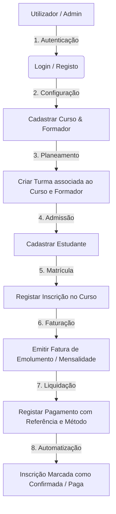
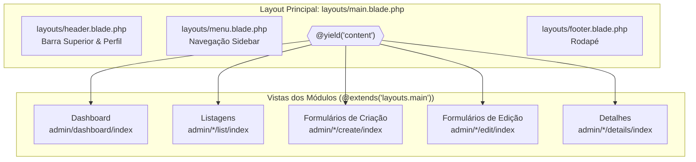
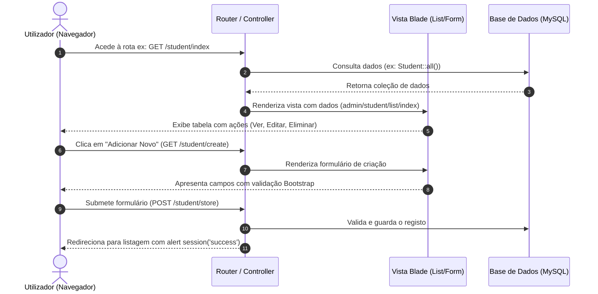

# Documentação do Fluxo do Projeto - Centro de Formação

Este documento descreve detalhadamente o funcionamento, arquitetura da base de dados, arquitetura das vistas (Blade templates), regras de negócio e fluxo operacional de todas as funcionalidades da plataforma **Centro de Formação**.

---

## 1. Visão Geral do Sistema

O **Centro de Formação** é uma plataforma web desenvolvida em **Laravel 7** projetada para automatizar a gestão académica e financeira de centros de formação e institutos de ensino.

### Tecnologias Utilizadas
- **Backend**: PHP (Laravel Framework 7.x)
- **Frontend**: Blade Templating, HTML5, CSS3 Vanilla / Bootstrap, JavaScript (ES6)
- **Tema UI**: Akademi / Metronic (Design Responsivo e Moderno)
- **Base de Dados**: MySQL / MariaDB (com Suporte a SoftDeletes)
- **Autenticação**: Laravel Session Auth Guard

---

## 2. Fluxo Principal da Aplicação (Passo a Passo)



### 2.1. Autenticação de Utilizadores
- **Login (`/login`)**: O utilizador insere e-mail e palavra-passe. Opcionalmente pode marcar *"Lembrar-me"*.
- **Registo (`/register`)**: Permite criar uma nova conta de operador/administrador no sistema.
- **Proteção de Rotas**: Todas as rotas administrativas (`/student`, `/course`, `/class`, `/enrollment`, `/invoice`, `/payment`) estão protegidas pelo middleware `auth`.
- **Logout (`/logout`)**: Encerra a sessão em segurança, invalida a sessão e redireciona para a página de login.

---

### 2.2. Gestão Académica (Cursos, Formadores e Turmas)

1. **Cursos (`Course`)**:
   - Cadastra os cursos disponíveis (ex: *Informática*, *Inglês*, *Contabilidade*).
   - Define nome, carga horária (duração em horas), estado (*Ativo/Inativo*) e descrição.

2. **Formadores / Professores (`Teacher`)**:
   - Regista os docentes com dados pessoais, Bilhete de Identidade, número de telefone, e-mail e fotografia de perfil.

3. **Turmas (`_Class`)**:
   - Associa um **Curso** e um **Formador** responsável a uma sala ou código de turma.
   - Define capacidade máxima, turno (*Manhã, Tarde, Pós-Laboral*), dias da semana e horários (`start_time` e `end_time`).

---

### 2.3. Admissão e Inscrição de Candidatos / Estudantes

1. **Unificação do Formulário de Inscrição e Candidato (`Enrollment` + `Student`)**:
   - Os candidatos realizam primeiro a sua inscrição no sistema através do formulário de inscrição (`enrollment.create`).
   - O formulário recolhe simultaneamente os dados pessoais do candidato (Nome completo, BI, E-mail, Telefone, Fotografia de perfil) e a seleção do Curso pretendido.
   - **Geração Automática de Código**: O sistema cria o registo do estudante na base de dados e gera automaticamente um código numérico sequencial único (ex: `1001`, `1002`).

2. **Condição para Estudante Ativo (Após Pagamento)**:
   - A inscrição é criada inicialmente com o estado **Pendente** (`status = 0`).
   - O candidato só é considerado formando / estudante ativo na listagem de estudantes após a liquidação do pagamento e confirmação da inscrição (`status = 1`).

---

### 2.4. Fluxo Financeiro (Faturas e Pagamentos)

1. **Faturas (`Invoice`)**:
   - Emissão de fatura vinculada à **Inscrição** e ao **Curso**.
   - O sistema calcula automaticamente:
     - **Valor a Pagar** (`amount_to_pay`)
     - **Valor Efetivamente Pago** (`amount_paid`)
     - **Troco** (`change`): Calculado como `max(0, amount_paid - amount_to_pay)`.

2. **Pagamentos (`Payment`)**:
   - Registo da transação bancária ou caixa física.
   - Campos: Tipo de Emolumento, Valor, Método de Pagamento (*Numerário, TPA, Transferência*), Moeda (`Kz / AOA`) e Data.
   - **Geração de Referência**: Caso não seja enviada uma referência, o sistema gera automaticamente uma referência numérica aleatória de 8 dígitos.

3. **Automatização de Confirmação de Inscrição**:
   - Quando um pagamento ou fatura é marcado como **Concluído/Pago** (`status = 1` ou `amount_paid >= amount_to_pay`), o sistema atualiza automaticamente o estado da **Inscrição** correspondente para **Confirmada** (`status = 1`).

---

## 3. Arquitetura e Fluxo das Vistas (Blade Templates & UI Flow)

A camada de apresentação do sistema foi desenhada com base no motor de modelos **Blade** do Laravel, adotando a estrutura modular e responsiva do tema **Akademi**.

### 3.1. Hierarquia de Layouts e Herança Blade



### 3.2. Estrutura de Diretórios de Vistas

```
resources/views/
├── admin/
│   ├── dashboard/
│   │   └── index.blade.php         # Painel com cartões de resumos estatísticos
│   ├── student/
│   │   ├── list/index.blade.php    # Tabela com filtro e listagem de alunos
│   │   ├── create/index.blade.php  # Form de registo de estudante + upload foto
│   │   ├── edit/index.blade.php    # Form de atualização do estudante
│   │   └── details/index.blade.php # Perfil completo do estudante
│   ├── course/
│   │   ├── list/index.blade.php    # Lista de cursos
│   │   ├── create/index.blade.php  # Cadastro de novo curso
│   │   ├── edit/index.blade.php    # Edição de curso
│   │   └── details/index.blade.php # Ficha técnica do curso
│   ├── teacher/
│   │   ├── list/index.blade.php    # Lista de formadores
│   │   ├── create/index.blade.php  # Registo de formador + foto
│   │   ├── edit/index.blade.php    # Edição de dados do formador
│   │   └── details/index.blade.php # Ficha detalhada do formador
│   ├── room/                        # Módulo de Turmas (Class)
│   │   ├── list/index.blade.php    # Listagem das turmas
│   │   ├── create/index.blade.php  # Criação de turma (Curso, Formador, Turno)
│   │   ├── edit/index.blade.php    # Alteração da turma
│   │   └── details/index.blade.php # Detalhes da turma e alunos associados
│   ├── enrollment/
│   │   ├── list/index.blade.php    # Histórico de inscrições
│   │   ├── create/index.blade.php  # Seleção de Estudante + Curso + Data
│   │   ├── edit/index.blade.php    # Alteração do estado da inscrição
│   │   └── details/index.blade.php # Ficha da inscrição
│   ├── invoice/
│   │   ├── list/index.blade.php    # Lista de faturas emitidas
│   │   ├── create/index.blade.php  # Emissão de fatura (Troco e totais auto)
│   │   ├── edit/index.blade.php    # Edição de valores da fatura
│   │   └── details/index.blade.php # Visualização/Impressão da Fatura
│   └── payment/
│       ├── list/index.blade.php    # Tabela de transações e comprovativos
│       ├── create/index.blade.php  # Registo de pagamento (TPA, Numerário, Referência)
│       ├── edit/index.blade.php    # Atualização do pagamento
│       └── details/index.blade.php # Recibo e dados do pagamento
├── auth/
│   ├── login.blade.php             # Tela limpa de login
│   └── register.blade.php          # Tela de registo de utilizador
└── layouts/
    ├── main.blade.php              # Shell principal com scripts e CSS
    ├── header.blade.php            # Navbar superior (User dropdown & Logout)
    ├── menu.blade.php              # Menu lateral dinâmico (MetisMenu)
    └── footer.blade.php            # Rodapé com copyright
```

### 3.3. Ciclo de Interação do Utilizador nas Vistas (UI Navigation Flow)



---

## 4. Arquitetura da Base de Dados

O modelo de dados é composto por 8 tabelas principais conectadas por chaves estrangeiras (`foreignId`) e suporte a Soft Deletes:

```
+----------------+        +-----------------+        +----------------+
|    courses     |<-------|     classes     |------->|    teachers    |
+----------------+        +-----------------+        +----------------+
        ^                         ^                          
        |                         |                          
+----------------+                |                  +----------------+
|  enrollments   |----------------+                  |    students    |
+----------------+<----------------------------------+----------------+
        ^                                                    ^
        |                                                    |
+----------------+                                           |
|    invoices    |-------------------------------------------+
+----------------+
        |
        v
+----------------+
|    payments    |
+----------------+
```

### Detalhe das Tabelas Principais

| Tabela | Função Principal | Relacionamentos Chave |
| :--- | :--- | :--- |
| `users` | Operadores e Administradores do sistema | Autenticação nativa Laravel |
| `courses` | Cursos disponíveis no centro | `hasMany(_Class)`, `hasMany(Enrollment)` |
| `teachers` | Corpo docente / Formadores | `hasMany(_Class)` |
| `classes` | Turmas e horários das aulas | `belongsTo(Course)`, `belongsTo(Teacher)` |
| `students` | Ficha do aluno e contactos | `hasMany(Enrollment)` |
| `enrollments` | Registo de matriculas | `belongsTo(Student)`, `belongsTo(Course)` |
| `invoices` | Faturas emitidas | `belongsTo(Enrollment)`, `belongsTo(Course)`, `belongsTo(Payment)` |
| `payments` | Comprovativos e transações | `hasOne(Invoice)` |

---

## 5. Regras de Negócio e Funcionalidades Especiais

1. **Exclusão Lógica (`SoftDeletes`)**:
   - Nenhuma informação crítica (Cursos, Alunos, Professores, Turmas, Inscrições, Faturas, Pagamentos) é removida permanentemente do banco de dados ao clicar em "Eliminar". O sistema preenche a coluna `deleted_at`, preservando o histórico auditável.

2. **Gestão de Imagens e Ficheiros**:
   - Os uploads de fotos de Estudantes e Formadores são processados e armazenados em `storage/app/public/img/student` e `storage/app/public/img/teacher`.
   - Ao atualizar ou eliminar um registo com foto, o ficheiro antigo é automaticamente removido do disco para poupar espaço.

3. **Validação Rigorosa de Dados**:
   - Todos os formulários possuem validação no backend com mensagens amigáveis em português (ex: obrigatoriedade de e-mail válido, imagens no formato JPG/PNG até 2MB, valores numéricos não negativos).

---

## 6. Rotas do Sistema

| Módulo | Prefixo de Rota | Ações Disponíveis |
| :--- | :--- | :--- |
| **Autenticação** | `/login`, `/register`, `/logout` | Exibir formulários, Autenticar, Registar, Encerrar sessão |
| **Dashboard** | `/dashboard/main`, `/` | Painel de controlo principal |
| **Cursos** | `/course/*` | `index`, `create`, `store`, `show`, `edit`, `update`, `destroy` |
| **Estudantes** | `/student/*` | `index`, `create`, `store`, `show`, `edit`, `update`, `destroy` |
| **Formadores** | `/teacher/*` | `index`, `create`, `store`, `show`, `edit`, `update`, `destroy` |
| **Turmas** | `/class/*` | `index`, `create`, `store`, `show`, `edit`, `update`, `destroy` |
| **Inscrições** | `/enrollment/*` | `index`, `create`, `store`, `show`, `edit`, `update`, `destroy` |
| **Faturas** | `/invoice/*` | `index`, `create`, `store`, `show`, `edit`, `update`, `destroy` |
| **Pagamentos** | `/payment/*` | `index`, `create`, `store`, `show`, `edit`, `update`, `destroy` |
